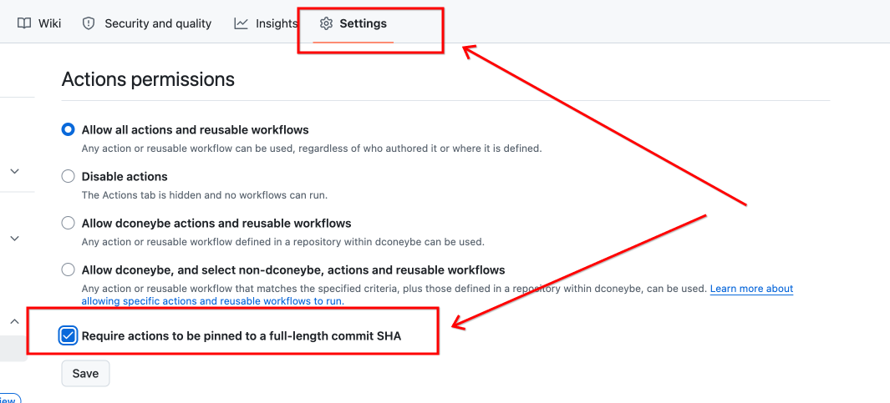
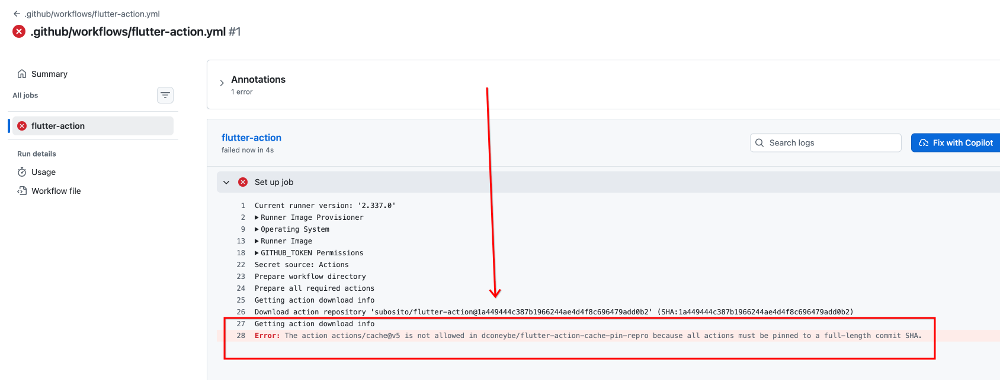

# Bug Repro: Unpinned Action in `subosito/flutter-action`

Reproduction repository for a bug in https://github.com/subosito/flutter-action.

## Problem

When a GitHub repository enables **"Require actions to be pinned to a full-length commit SHA"** in its Actions permissions settings:



Workflows using https://github.com/subosito/flutter-action fail immediately with the following error:

```text
Error: The action actions/cache@v5 is not allowed in dconeybe/flutter-action-cache-pin-repro
because all actions must be pinned to a full-length commit SHA.
```



See the workflow run that produced this error: https://github.com/dconeybe/flutter-action-cache-pin-repro/actions/runs/33915343099/job/101161108807

## Cause

In https://github.com/subosito/flutter-action/blob/4cab68ce0f1c7c924f688bff4792e044f1aeb30c/action.yaml
the `cache` action is referenced by tag rather than a commit SHA:

```yaml
uses: actions/cache@v5
```

## Solution

Pinning the action to a full-length commit SHA resolves the error:

```yaml
uses: actions/cache@caa296126883cff596d87d8935842f9db880ef25 # v5.1.0
```
